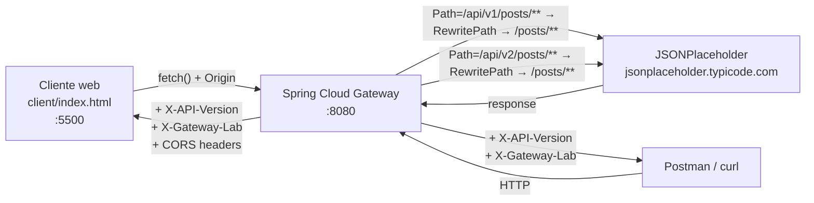

# Laboratorio 1 · API Gateway local con Spring Cloud Gateway

**Asignatura:** DSY1107 · Desarrollo Cloud Native I
**Semana:** 01 · **Grupo:** 01
**Modalidad:** individual · **Entrega:** repositorio GitHub

## 1. Integrantes

- Jonathan Larraguibel

## 2. Objetivo

Comprender API Gateway, routing, HTTP a nivel 2 de Richardson Maturity Model, versionado y CORS mediante **configuración**, sin programar lógica de negocio. Este laboratorio reemplaza temporalmente la práctica en Amazon API Gateway: la tecnología es distinta (Spring Cloud Gateway en vez de AWS), pero los conceptos son equivalentes — punto de entrada, ruta, integración, políticas transversales, versionado y CORS.

## 3. Arquitectura



### Cliente / Gateway / Backend

| Componente | Rol | Qué se programó |
|---|---|---|
| **Cliente** | Postman/`curl` para pruebas generales; `client/index.html` (provisto, sin modificar) para comprobar CORS desde navegador | Nada |
| **Gateway** | Spring Cloud Gateway. Único componente configurado durante el laboratorio | Solo `gateway/src/main/resources/application.yml` |
| **Backend** | API pública de prueba [JSONPlaceholder](https://jsonplaceholder.typicode.com). Simula creación/actualización/eliminación, no persiste cambios | Nada |

## 4. Requisitos

- JDK 21+
- Maven 3.9+
- Git
- `curl` (o Postman)
- Navegador
- Conexión a Internet (el backend es un servicio externo)

Verificar:

```bash
java -version
mvn -version
git --version
```

## 5. Cómo ejecutar

### 5.1 Levantar el gateway

```bash
cd gateway
mvn spring-boot:run
```

Queda escuchando en `http://localhost:8080`. Mantener la terminal abierta.

### 5.2 Prueba mínima

```bash
curl -i http://localhost:8080/api/v1/posts/1
```

Deben verse los headers `X-API-Version: v1` y `X-Gateway-Lab: DSY1107`.

### 5.3 Cliente web (prueba de CORS)

Desde otra terminal, servir `client/` como sitio estático en el puerto 5500 (el único origen permitido por la configuración CORS del gateway):

```bash
cd client
python3 -m http.server 5500
```

Abrir `http://localhost:5500` y presionar el botón. También puede usarse la extensión **Live Server** de VS Code configurada en el puerto 5500.

## 6. Rutas configuradas

| Route id | Predicate | Backend | Filtros |
|---|---|---|---|
| `posts-v1` | `Path=/api/v1/posts/**` | `https://jsonplaceholder.typicode.com` | `RewritePath`, `AddResponseHeader=X-API-Version, v1` |
| `posts-v2` | `Path=/api/v2/posts/**` | `https://jsonplaceholder.typicode.com` | `RewritePath`, `AddResponseHeader=X-API-Version, v2` |

**Filtros globales** (`default-filters`, aplican a toda ruta):

- `AddResponseHeader=X-Gateway-Lab, DSY1107`
- `DedupeResponseHeader=Access-Control-Allow-Origin Access-Control-Allow-Credentials, RETAIN_UNIQUE` — ver [sección 9](#9-problemas-encontrados).

**CORS** (`globalcors`): origen permitido `http://localhost:5500` (y `127.0.0.1:5500`), métodos `GET, POST, PUT, DELETE, OPTIONS`, header `Content-Type`.

## 7. Pruebas HTTP realizadas

Todas las pruebas y su evidencia completa (status codes, headers, bodies) están en [`docs/evidencias.md`](docs/evidencias.md). Resumen:

| Método | Ruta | Status |
|---|---|---:|
| GET | `/api/v1/posts` | 200 |
| GET | `/api/v1/posts/1` | 200 |
| POST | `/api/v1/posts` | 201 |
| PUT | `/api/v1/posts/1` | 200 |
| DELETE | `/api/v1/posts/1` | 200 |
| GET | `/api/v2/posts/1` | 200 |

## 8. Richardson Maturity Model nivel 2

La API expone **recursos identificables por URL** (`/posts`, `/posts/{id}`), no verbos en la ruta. Sobre esos recursos se usan **métodos HTTP con significado propio** (`GET` lee, `POST` crea, `PUT` reemplaza, `DELETE` elimina) y **status codes con semántica real** (`200` en lecturas/actualizaciones, `201` con header `Location` en creación). Esa combinación —recursos + verbos + status codes correctos— es lo que define el nivel 2 de Richardson. Detalle completo en `docs/evidencias.md` sección 8.

## 9. Versionado

`/api/v1` y `/api/v2` conviven apuntando al **mismo backend físico**; la única diferencia es la configuración del gateway (predicate + header de respuesta). Mantener ambas versiones evita romper consumidores que aún no migraron al nuevo contrato. El versionado del contrato público (la URL que ve el cliente) es independiente de cuántas instancias del servidor corren detrás — aquí no hay dos despliegues, solo dos rutas. Preguntas de reflexión respondidas en `docs/evidencias.md` sección 5.

## 10. CORS

Se configuró `globalcors` para permitir únicamente `http://localhost:5500`. Se verificó tanto por `curl` como en un **navegador real**:

- Origen permitido (`:5500`) → petición exitosa, headers `Access-Control-Allow-*` presentes.
- Origen no permitido (`:5501` / `:9999`) → `403 Forbidden` en preflight y en petición simple; en el navegador, `TypeError: Failed to fetch`.

Detalle completo, incluyendo un hallazgo no trivial (ver sección 11), en `docs/evidencias.md` sección 7.

## 11. Problemas encontrados

**1. Header `Access-Control-Allow-Origin` duplicado.** Al activar `globalcors`, el cliente dejó de funcionar: la respuesta traía el header repetido (uno de JSONPlaceholder, otro del gateway) y el navegador la rechazó (`... contains multiple values ..., but only one is allowed`). Causa: el backend ya responde su propio CORS permisivo, y el gateway agrega el suyo sin reemplazar el existente. Solución: filtro `DedupeResponseHeader=Access-Control-Allow-Origin Access-Control-Allow-Credentials, RETAIN_UNIQUE`.

**2. La prueba "antes de CORS" no mostraba ningún fallo.** El cliente provisto solo hace `GET` simple (sin preflight), y JSONPlaceholder ya es permisivo por su cuenta, así que la petición pasaba igual sin que el gateway tuviera política propia. Se complementó la evidencia probando el `OPTIONS` de preflight directamente por `curl` (que sí mostraba ausencia de headers CORS) y bloqueando un origen no autorizado después de configurar CORS, para demostrar el efecto real de la política del gateway.

Ambos problemas, con más detalle, en `docs/evidencias.md` sección 10.

## 12. Responsabilidades: cliente / gateway / backend

| Responsabilidad | Dónde vive | Por qué |
|---|---|---|
| Routing | Gateway | Decide, según `Path`, a qué integración enviar la petición |
| Transformación de rutas | Gateway | `RewritePath` adapta el prefijo de versión al path real del backend |
| Header transversal / observabilidad | Gateway | Política única (`default-filters`), no se repite por backend |
| CORS | Gateway | Punto de entrada único para decidir qué orígenes pueden leer la respuesta |
| Lógica de negocio | Backend | El gateway no interpreta el significado de los datos |
| Persistencia | Backend | Los datos viven ahí, nunca en el gateway |
| Reglas de negocio | Backend | Ej. validaciones de dominio; el gateway no conoce el dominio |
| Autenticación/autorización | _(no configurada en este lab)_ | Conceptualmente correspondería centralizarla en el gateway |

Tabla completa y justificaciones extendidas en `docs/evidencias.md` sección 9.

## 13. Conclusiones

- El gateway desacopló al cliente del backend real: el cliente solo conoce `localhost:8080`, nunca la URL física de JSONPlaceholder.
- Centralizó responsabilidades transversales (versionado, header de trazabilidad, CORS) que de otro modo habría que repetir en cada backend.
- El aprendizaje que **no** depende de Spring Cloud Gateway: CORS se resuelve sobre el header final que recibe el navegador, sin importar quién lo puso — por eso un backend permisivo puede "filtrarse" a través de un gateway sin política propia, y por eso agregar CORS sin considerar lo que ya envía el backend puede duplicar headers. Es un problema general de cualquier gateway que reenvía tráfico hacia backends que también gestionan CORS, sin importar la tecnología.
- Equivalencia con Amazon API Gateway: cada `route` (predicate + uri) equivale a un *resource/method* con su *integration*; los `filters` equivalen a transformaciones de integración; `globalcors` equivale a la configuración CORS integrada de una HTTP API.

Conclusiones completas en `docs/evidencias.md` sección 12.

## 14. Colaboración GitHub

Actividad realizada de forma individual (Jonathan Larraguibel). Aun así, el trabajo se organizó por ramas separadas por etapa, siguiendo la misma estrategia que pide la guía para un equipo:

| Rama | Pull Request | Aporte |
|---|---|---|
| `feature/routing-v1` | mergeado directo a `main` (sin PR — ver nota) | Parte A/B: gateway funcional, evidencia backend directo, CRUD vía gateway |
| `feature/version-v2` | [#1](https://github.com/jhonnylarry/dsy1107-lab-api-gateway-grupo-01/pull/1) | Parte C: ruta `posts-v2`, header `X-API-Version` |
| `feature/gateway-header` | [#2](https://github.com/jhonnylarry/dsy1107-lab-api-gateway-grupo-01/pull/2) | Parte D: header transversal, tabla de responsabilidades |
| `feature/cors` | [#3](https://github.com/jhonnylarry/dsy1107-lab-api-gateway-grupo-01/pull/3) | Parte E: CORS, fix de header duplicado |
| `docs/evidencias` | [#4](https://github.com/jhonnylarry/dsy1107-lab-api-gateway-grupo-01/pull/4) | Parte F: README, cierre de evidencias |

Detalle en `docs/evidencias.md` sección 11.

## 15. Estructura del repositorio

```text
dsy1107-lab-api-gateway-grupo-01/
├── README.md
├── docs/
│   └── evidencias.md
├── client/
│   └── index.html
└── gateway/
    ├── pom.xml
    └── src/main/
        ├── java/cl/duoc/dsy1107/gateway/ApiGatewayLabApplication.java
        └── resources/
            └── application.yml
```

## 16. Limitaciones conocidas

- JSONPlaceholder simula creación/actualización/eliminación; los cambios no persisten realmente en el backend.
- No se configuró autenticación/autorización en el gateway (fuera del alcance de este laboratorio).
- El primer merge (`feature/routing-v1`) se hizo por línea de comandos en vez de Pull Request en GitHub — ver nota en sección 14.
