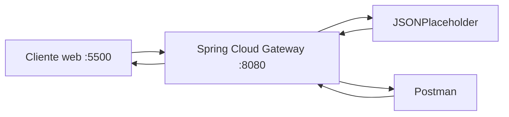

# Evidencias · Laboratorio API Gateway

## Integrantes
- Jonathan Larraguibel
- Nombre:
- Nombre:

## 1. Backend directo

Antes de utilizar el gateway, registrar las pruebas directas contra JSONPlaceholder.

| Método | URL | Status | Observación |
|---|---|---:|---|
| GET | `https://jsonplaceholder.typicode.com/posts` | 200 | Devuelve el arreglo completo de posts (100 elementos), `Content-Type: application/json` |
| GET | `https://jsonplaceholder.typicode.com/posts/1` | 200 | Devuelve un único objeto JSON (`userId`, `id`, `title`, `body`) |

**¿Qué información del backend conoce el cliente en este escenario?**

Respuesta: El cliente conoce la dirección física completa del backend (`https://jsonplaceholder.typicode.com`) y su estructura de rutas (`/posts`, `/posts/{id}`). Si el backend cambiara de dominio, se dividiera en varios microservicios o se moviera a otra infraestructura, cada cliente que lo invoca directamente dejaría de funcionar y tendría que actualizarse uno por uno. Con muchos servicios esto se vuelve inmanejable: no existe un único punto donde aplicar cambios, políticas de seguridad o versionado. Ese es exactamente el problema que resuelve un API Gateway: el cliente solo conoce la URL del gateway, y es el gateway quien sabe (y puede cambiar) dónde vive realmente cada backend.

---

## 2. Arquitectura final



Explicar brevemente qué responsabilidad cumple cada componente.

---

## 3. Pruebas HTTP mediante gateway

| Método | URL | Status | Headers relevantes | Interpretación |
|---|---|---:|---|---|
| GET | `/api/v1/posts` | 200 | `Content-Type: application/json`, `x-powered-by: Express` | colección |
| GET | `/api/v1/posts/1` | 200 | `Content-Type: application/json`, `x-powered-by: Express` | recurso individual |
| POST | `/api/v1/posts` | 201 | `Content-Type: application/json`, `location: .../posts/101` | creación simulada |
| PUT | `/api/v1/posts/1` | 200 | `Content-Type: application/json` | actualización simulada |
| DELETE | `/api/v1/posts/1` | 200 | `Content-Type: application/json`, body `{}` | eliminación simulada |

Body enviado en **POST** `/api/v1/posts`:
```json
{"title":"Cloud Native","body":"Laboratorio API Gateway","userId":1}
```
Respuesta: `{"title":"Cloud Native","body":"Laboratorio API Gateway","userId":1,"id":101}` — JSONPlaceholder asigna `id: 101` (simulado, no se persiste realmente).

Body enviado en **PUT** `/api/v1/posts/1`:
```json
{"id":1,"title":"Cloud Native actualizado","body":"Prueba PUT mediante gateway","userId":1}
```
Respuesta: devuelve el mismo objeto enviado, con status `200`.

**DELETE** `/api/v1/posts/1` responde `200 OK` con body `{}` — confirma la eliminación sin devolver contenido.

> El header `x-powered-by: Express` es el sello del backend real (JSONPlaceholder corre sobre Express). Que llegue intacto hasta el cliente confirma que el gateway efectivamente reenvió la petición y no respondió con datos propios.
>
> **Importante:** JSONPlaceholder *simula* creación, actualización y eliminación — no persiste los cambios. Un GET posterior a `/api/v1/posts/1` seguiría devolviendo el recurso original sin modificar.

---

## 4. Routing

- URL solicitada por el cliente: `http://localhost:8080/api/v1/posts/1`
- `id` de la route: `posts-v1`
- predicate que hizo match: `Path=/api/v1/posts/**`
- URI/integration configurada: `https://jsonplaceholder.typicode.com`
- path recibido finalmente por el backend: `/posts/1`
- función de `RewritePath`: toma la ruta original con el patrón `/api/v1/(?<segment>.*)` y la reescribe a `/${segment}` antes de reenviarla al backend. Es lo que permite que el cliente use un prefijo de versión (`/api/v1/...`) que el backend real ni siquiera conoce.

### Recorrido de una petición

Explicar con sus palabras:

```text
cliente → gateway → backend → gateway → cliente
```

1. El cliente hace `GET http://localhost:8080/api/v1/posts/1`. Solo conoce el gateway, no el backend real.
2. El gateway evalúa sus routes en orden y encuentra que el predicate `Path=/api/v1/posts/**` de la route `posts-v1` hace match.
3. Aplica el filtro `RewritePath`: transforma `/api/v1/posts/1` en `/posts/1`.
4. El gateway reenvía la petición ya reescrita a la `uri` configurada: `https://jsonplaceholder.typicode.com/posts/1`.
5. JSONPlaceholder procesa la petición como si fuera un cliente directo y responde `200 OK` con el JSON del post.
6. El gateway recibe esa respuesta y la devuelve al cliente original, agregando los headers propios que tenga configurados (en etapas posteriores: `X-API-Version`, `X-Gateway-Lab`).
7. El cliente recibe la respuesta sin haber conocido en ningún momento la URL real del backend.

---

## 5. Versionado

- Evidencia `/api/v1`: `GET http://localhost:8080/api/v1/posts/1` → `200 OK`
- Header `X-API-Version` observado: `v1`
- Evidencia `/api/v2`: `GET http://localhost:8080/api/v2/posts/1` → `200 OK`
- Header `X-API-Version` observado: `v2`

Ambas rutas apuntan al **mismo backend** (`https://jsonplaceholder.typicode.com`); la única diferencia está en la configuración del gateway: el predicate que hace match (`/api/v1/posts/**` vs `/api/v2/posts/**`) y el header que cada route agrega en la respuesta.

Responder:

1. **¿Por qué mantener v1 y v2 simultáneamente?** Porque distintos consumidores pueden depender de contratos distintos (campos, formatos, comportamiento) y no todos pueden migrar al mismo tiempo. Mantener ambas versiones evita romper integraciones existentes mientras se habilita la nueva.
2. **¿Qué consumidores podrían seguir usando v1?** Clientes externos, integraciones de terceros o versiones antiguas de una app móvil/web que todavía no se actualizaron al nuevo contrato.
3. **¿Cuándo retirarían una versión?** Cuando se pueda confirmar (por ejemplo mediante métricas de tráfico) que ya no quedan consumidores usando esa versión, y después de haber comunicado un período de deprecación con anticipación.
4. **¿Versionar el contrato público es lo mismo que versionar el servidor desplegado?** No. Aquí `v1` y `v2` son simplemente dos routes del gateway apuntando al mismo backend físico — no hay dos despliegues distintos del servidor. El versionado del contrato (la URL/API que ve el cliente) es independiente de cuántas instancias o versiones de software corren detrás.

---

## 6. Header transversal

- Header esperado: `X-Gateway-Lab: DSY1107`
- Evidencia observada:
- ¿Por qué este comportamiento puede considerarse transversal?:

---

## 7. CORS

### Antes de configurar CORS

- URL del cliente web: `http://localhost:5500`
- Endpoint consultado:
- Resultado visible:
- Mensaje relevante en Console/Network:

### Después de configurar CORS

- Resultado visible:
- `Access-Control-Allow-Origin`:
- `Access-Control-Allow-Methods`:

### Preflight OPTIONS

- Request utilizado:
- Status:
- Headers relevantes:

Responder:

1. ¿Por qué Postman puede funcionar cuando el navegador falla?
2. ¿Qué es un preflight?
3. ¿CORS autentica o autoriza usuarios?
4. ¿Qué riesgo tendría permitir cualquier origen sin analizar el contexto?

---

## 8. Richardson Maturity Model nivel 2

Explicar qué elementos observados en el laboratorio permiten afirmar que la API utiliza recursos, métodos HTTP y status codes con semántica HTTP.

Respuesta: la API expone **recursos identificables por URL** (`/posts` como colección, `/posts/1` como recurso individual), no acciones o verbos en la ruta (no existe algo como `/getPost` o `/deletePost`). Sobre esos mismos recursos se usan **distintos métodos HTTP según la operación**: `GET` para leer, `POST` para crear, `PUT` para reemplazar y `DELETE` para eliminar — el mismo recurso `/posts/1` cambia de comportamiento según el verbo, no según la ruta. Y los **status codes tienen significado real**: `200` para lecturas y actualizaciones exitosas, `201` para creación (con header `location` apuntando al nuevo recurso), y el mismo `200` con body vacío para una eliminación confirmada. Esa combinación — recursos + verbos con semántica + status codes correctos — es exactamente lo que define el nivel 2 de Richardson.

---

## 9. Responsabilidades

| Responsabilidad | Cliente | Gateway | Backend | Justificación |
|---|:---:|:---:|:---:|---|
| routing | | | | |
| lógica de negocio | | | | |
| autenticación/autorización | | | | |
| transformación de rutas | | | | |
| persistencia | | | | |
| rate limiting | | | | |
| reglas de negocio | | | | |
| observabilidad | | | | |

---

## 10. Problemas encontrados

1. Problema:
   - causa:
   - solución:

---

## 11. Colaboración GitHub

| Integrante | Rama | Pull Request | Aporte principal |
|---|---|---|---|
| | | | |

Agregar enlaces a los Pull Requests.

---

## 12. Conclusiones

- ¿Qué problema resolvió el gateway?
- ¿Qué concepto del laboratorio sería equivalente al trabajar posteriormente con Amazon API Gateway?
- ¿Qué aprendió el grupo que no depende específicamente de Spring Cloud Gateway?
