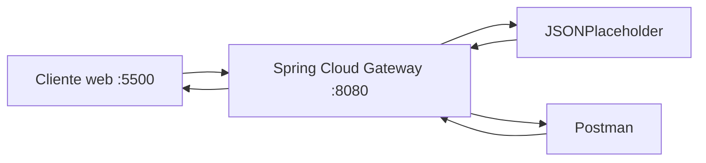

# Evidencias · Laboratorio API Gateway

## Integrantes
- Jonathan Larraguibel (actividad realizada de forma individual)

## 1. Backend directo

Antes de utilizar el gateway, registrar las pruebas directas contra JSONPlaceholder.

| Método | URL | Status | Observación |
|---|---|---:|---|
| GET | `https://jsonplaceholder.typicode.com/posts` | 200 | Devuelve el arreglo completo de posts (100 elementos), `Content-Type: application/json` |
| GET | `https://jsonplaceholder.typicode.com/posts/1` | 200 | Devuelve un único objeto JSON (`userId`, `id`, `title`, `body`) |

**¿Qué información del backend conoce el cliente en este escenario?**

Respuesta: El cliente conoce la dirección física completa del backend (`https://jsonplaceholder.typicode.com`) y su estructura de rutas (`/posts`, `/posts/{id}`). Si el backend cambiara de dominio, se dividiera en varios microservicios o se moviera a otra infraestructura, cada cliente que lo invoca directamente dejaría de funcionar y tendría que actualizarse uno por uno. Con muchos servicios esto se vuelve inmanejable: no existe un único punto donde aplicar cambios, políticas de seguridad o versionado. Ese es exactamente el problema que resuelve un API Gateway: el cliente solo conoce la URL del gateway, y es el gateway quien sabe (y puede cambiar) dónde vive realmente cada backend.

---

## 2. Arquitectura final



Explicar brevemente qué responsabilidad cumple cada componente.

---

## 3. Pruebas HTTP mediante gateway

| Método | URL | Status | Headers relevantes | Interpretación |
|---|---|---:|---|---|
| GET | `/api/v1/posts` | 200 | `Content-Type: application/json`, `x-powered-by: Express` | colección |
| GET | `/api/v1/posts/1` | 200 | `Content-Type: application/json`, `x-powered-by: Express` | recurso individual |
| POST | `/api/v1/posts` | 201 | `Content-Type: application/json`, `location: .../posts/101` | creación simulada |
| PUT | `/api/v1/posts/1` | 200 | `Content-Type: application/json` | actualización simulada |
| DELETE | `/api/v1/posts/1` | 200 | `Content-Type: application/json`, body `{}` | eliminación simulada |

Body enviado en **POST** `/api/v1/posts`:
```json
{"title":"Cloud Native","body":"Laboratorio API Gateway","userId":1}
```
Respuesta: `{"title":"Cloud Native","body":"Laboratorio API Gateway","userId":1,"id":101}` — JSONPlaceholder asigna `id: 101` (simulado, no se persiste realmente).

Body enviado en **PUT** `/api/v1/posts/1`:
```json
{"id":1,"title":"Cloud Native actualizado","body":"Prueba PUT mediante gateway","userId":1}
```
Respuesta: devuelve el mismo objeto enviado, con status `200`.

**DELETE** `/api/v1/posts/1` responde `200 OK` con body `{}` — confirma la eliminación sin devolver contenido.

> El header `x-powered-by: Express` es el sello del backend real (JSONPlaceholder corre sobre Express). Que llegue intacto hasta el cliente confirma que el gateway efectivamente reenvió la petición y no respondió con datos propios.
>
> **Importante:** JSONPlaceholder *simula* creación, actualización y eliminación — no persiste los cambios. Un GET posterior a `/api/v1/posts/1` seguiría devolviendo el recurso original sin modificar.

---

## 4. Routing

- URL solicitada por el cliente: `http://localhost:8080/api/v1/posts/1`
- `id` de la route: `posts-v1`
- predicate que hizo match: `Path=/api/v1/posts/**`
- URI/integration configurada: `https://jsonplaceholder.typicode.com`
- path recibido finalmente por el backend: `/posts/1`
- función de `RewritePath`: toma la ruta original con el patrón `/api/v1/(?<segment>.*)` y la reescribe a `/${segment}` antes de reenviarla al backend. Es lo que permite que el cliente use un prefijo de versión (`/api/v1/...`) que el backend real ni siquiera conoce.

### Recorrido de una petición

Explicar con sus palabras:

```text
cliente → gateway → backend → gateway → cliente
```

1. El cliente hace `GET http://localhost:8080/api/v1/posts/1`. Solo conoce el gateway, no el backend real.
2. El gateway evalúa sus routes en orden y encuentra que el predicate `Path=/api/v1/posts/**` de la route `posts-v1` hace match.
3. Aplica el filtro `RewritePath`: transforma `/api/v1/posts/1` en `/posts/1`.
4. El gateway reenvía la petición ya reescrita a la `uri` configurada: `https://jsonplaceholder.typicode.com/posts/1`.
5. JSONPlaceholder procesa la petición como si fuera un cliente directo y responde `200 OK` con el JSON del post.
6. El gateway recibe esa respuesta y la devuelve al cliente original, agregando los headers propios que tenga configurados (en etapas posteriores: `X-API-Version`, `X-Gateway-Lab`).
7. El cliente recibe la respuesta sin haber conocido en ningún momento la URL real del backend.

---

## 5. Versionado

- Evidencia `/api/v1`: `GET http://localhost:8080/api/v1/posts/1` → `200 OK`
- Header `X-API-Version` observado: `v1`
- Evidencia `/api/v2`: `GET http://localhost:8080/api/v2/posts/1` → `200 OK`
- Header `X-API-Version` observado: `v2`

Ambas rutas apuntan al **mismo backend** (`https://jsonplaceholder.typicode.com`); la única diferencia está en la configuración del gateway: el predicate que hace match (`/api/v1/posts/**` vs `/api/v2/posts/**`) y el header que cada route agrega en la respuesta.

Responder:

1. **¿Por qué mantener v1 y v2 simultáneamente?** Porque distintos consumidores pueden depender de contratos distintos (campos, formatos, comportamiento) y no todos pueden migrar al mismo tiempo. Mantener ambas versiones evita romper integraciones existentes mientras se habilita la nueva.
2. **¿Qué consumidores podrían seguir usando v1?** Clientes externos, integraciones de terceros o versiones antiguas de una app móvil/web que todavía no se actualizaron al nuevo contrato.
3. **¿Cuándo retirarían una versión?** Cuando se pueda confirmar (por ejemplo mediante métricas de tráfico) que ya no quedan consumidores usando esa versión, y después de haber comunicado un período de deprecación con anticipación.
4. **¿Versionar el contrato público es lo mismo que versionar el servidor desplegado?** No. Aquí `v1` y `v2` son simplemente dos routes del gateway apuntando al mismo backend físico — no hay dos despliegues distintos del servidor. El versionado del contrato (la URL/API que ve el cliente) es independiente de cuántas instancias o versiones de software corren detrás.

---

## 6. Header transversal

- Header esperado: `X-Gateway-Lab: DSY1107`
- Evidencia observada: presente en `GET /api/v1/posts/1` (`X-API-Version: v1`, `X-Gateway-Lab: DSY1107`) y en `GET /api/v2/posts/1` (`X-API-Version: v2`, `X-Gateway-Lab: DSY1107`), ambos `200 OK`.
- ¿Por qué este comportamiento puede considerarse transversal?: porque se declaró una sola vez, en `default-filters` (a nivel de `webflux`, fuera de cualquier `route`), y se aplica automáticamente a la respuesta de **todas** las rutas del gateway. A diferencia de `X-API-Version`, que cada route declara individualmente porque su valor depende de cuál ruta hizo match, `X-Gateway-Lab` no varía y no debería repetirse en cada route — es una política del gateway como un todo, no de un endpoint en particular.

---

## 7. CORS

### Antes de configurar CORS

- URL del cliente web: `http://localhost:5500`
- Endpoint consultado: `GET http://localhost:8080/api/v1/posts/1`
- Resultado visible: la petición **funcionó** (`HTTP 200`, JSON completo en pantalla).
- Mensaje relevante en Console/Network: ninguno — no hubo error.

**Hallazgo no esperado por la guía:** con el cliente provisto (que solo hace `GET` sin headers personalizados), la petición tuvo éxito **incluso sin configurar `globalcors` en el gateway**. La causa: JSONPlaceholder ya responde su propio `access-control-allow-origin` reflejando cualquier `Origin` recibido, y el gateway, sin CORS propio configurado, deja pasar ese header del backend sin tocarlo. El navegador evalúa el header final que llega, sin importar si lo puso el gateway o el backend, así que la petición simple igual pasó.

Lo que sí falló antes de configurar CORS fue el **preflight**: `curl -X OPTIONS http://localhost:8080/api/v1/posts -H "Origin: http://localhost:5500" -H "Access-Control-Request-Method: POST" -H "Access-Control-Request-Headers: Content-Type"` devolvió `200 OK` con `content-length: 0` y **sin ningún header `Access-Control-*`**. Cualquier petición real que dependiera de ese preflight (un POST/PUT/DELETE con `Content-Type: application/json` desde un navegador) habría sido bloqueada.

### Después de configurar CORS

- Resultado visible: sigue funcionando (`HTTP 200`, JSON completo) desde `http://localhost:5500`.
- `Access-Control-Allow-Origin`: `http://localhost:5500`
- `Access-Control-Allow-Methods`: `GET,POST,PUT,DELETE,OPTIONS`

**Problema encontrado al configurar `globalcors`:** al agregar la política CORS del gateway, la respuesta terminó con el header `Access-Control-Allow-Origin` **duplicado** (uno puesto por JSONPlaceholder, otro por el gateway), ambos con el mismo valor. El navegador rechazó la respuesta con:

```text
Access to fetch at 'http://localhost:8080/api/v1/posts/1' from origin 'http://localhost:5500'
has been blocked by CORS policy: The 'Access-Control-Allow-Origin' header contains multiple
values 'http://localhost:5500, http://localhost:5500', but only one is allowed.
```

- **Causa:** Spring Cloud Gateway agrega su propio header CORS sin eliminar el que ya traía la respuesta del backend.
- **Solución:** se agregó el filtro `DedupeResponseHeader=Access-Control-Allow-Origin Access-Control-Allow-Credentials, RETAIN_UNIQUE` en `default-filters`, que colapsa los valores repetidos a uno solo. Verificado por `curl` (un único header) y en el navegador (la petición volvió a funcionar sin error de consola).

**Prueba de bloqueo real (origen no permitido):** se sirvió el mismo `client/index.html` en `http://localhost:5501` (puerto no declarado en `allowedOrigins`). Resultado: `TypeError: Failed to fetch` en el navegador. La misma petición vía `curl -H "Origin: http://localhost:9999"` devolvió `403 Forbidden` en el preflight y también en la petición GET simple — el gateway ahora bloquea activamente los orígenes no permitidos, en vez de solo dejar pasar lo que decida el backend.

### Preflight OPTIONS

- Request utilizado:
  ```bash
  curl -i -X OPTIONS http://localhost:8080/api/v1/posts \
    -H "Origin: http://localhost:5500" \
    -H "Access-Control-Request-Method: POST" \
    -H "Access-Control-Request-Headers: Content-Type"
  ```
- Status: `200 OK` (origen permitido) / `403 Forbidden` (origen `http://localhost:9999`, no permitido)
- Headers relevantes (origen permitido):
  ```text
  Access-Control-Allow-Origin: http://localhost:5500
  Access-Control-Allow-Methods: GET,POST,PUT,DELETE,OPTIONS
  Access-Control-Allow-Headers: Content-Type
  Access-Control-Max-Age: 3600
  ```

Responder:

1. **¿Por qué Postman puede funcionar cuando el navegador falla?** Postman no es un navegador y no implementa la Same-Origin Policy ni CORS. CORS es una restricción que aplican los navegadores sobre el código JavaScript que ellos mismos ejecutan, no una barrera del servidor contra cualquier cliente HTTP.
2. **¿Qué es un preflight?** Una petición `OPTIONS` que el navegador envía automáticamente antes de una petición "no simple" (por ejemplo `POST` con `Content-Type: application/json`), para preguntarle al servidor si el método, los headers y el origen están permitidos, antes de enviar la petición real.
3. **¿CORS autentica o autoriza usuarios?** No. CORS solo decide si el navegador deja que el JavaScript de una página lea la respuesta de otro origen. No verifica identidad ni permisos de negocio — un backend sigue necesitando sus propios mecanismos de autenticación/autorización.
4. **¿Qué riesgo tendría permitir cualquier origen sin analizar el contexto?** Con `Access-Control-Allow-Origin: *` (o reflejando cualquier origen, como hace JSONPlaceholder), cualquier sitio web podría leer las respuestas de la API desde el navegador de un usuario autenticado, exponiendo datos que deberían quedar restringidos a los orígenes realmente autorizados.

---

## 8. Richardson Maturity Model nivel 2

Explicar qué elementos observados en el laboratorio permiten afirmar que la API utiliza recursos, métodos HTTP y status codes con semántica HTTP.

Respuesta: la API expone **recursos identificables por URL** (`/posts` como colección, `/posts/1` como recurso individual), no acciones o verbos en la ruta (no existe algo como `/getPost` o `/deletePost`). Sobre esos mismos recursos se usan **distintos métodos HTTP según la operación**: `GET` para leer, `POST` para crear, `PUT` para reemplazar y `DELETE` para eliminar — el mismo recurso `/posts/1` cambia de comportamiento según el verbo, no según la ruta. Y los **status codes tienen significado real**: `200` para lecturas y actualizaciones exitosas, `201` para creación (con header `location` apuntando al nuevo recurso), y el mismo `200` con body vacío para una eliminación confirmada. Esa combinación — recursos + verbos con semántica + status codes correctos — es exactamente lo que define el nivel 2 de Richardson.

---

## 9. Responsabilidades

| Responsabilidad | Cliente | Gateway | Backend | Justificación |
|---|:---:|:---:|:---:|---|
| routing | | ✔ | | El gateway decide, según el `Path` de la petición, a qué integración/backend enviarla (`posts-v1` vs `posts-v2`). El cliente y el backend no participan de esa decisión. |
| lógica de negocio | | | ✔ | El gateway no interpreta ni transforma el significado de los datos (título, body, etc.); eso vive exclusivamente en el backend. |
| autenticación/autorización | | (no configurada en este laboratorio) | | No se implementó en este lab, pero conceptualmente es el gateway quien debería centralizarla como punto de entrada único, para no repetirla en cada backend. |
| transformación de rutas | | ✔ | | `RewritePath` convierte `/api/v1/posts/1` en `/posts/1` antes de reenviar. Es exclusivamente responsabilidad del gateway. |
| persistencia | | | ✔ | Los datos (reales o simulados, como en JSONPlaceholder) viven en el backend, nunca en el gateway. |
| rate limiting | | ✔ | | Es una política transversal aplicable a todo el tráfico de entrada; no tendría sentido implementarla por separado en cada backend. |
| reglas de negocio | | | ✔ | Ej.: validar que un título no esté vacío, o qué transiciones de estado son válidas. El gateway no conoce el dominio. |
| observabilidad del tráfico | | ✔ | | El header `X-Gateway-Lab` agregado mediante `default-filters` es un ejemplo simple: el gateway es el punto natural para medir y trazar todo lo que entra y sale, sin instrumentar cada backend por separado. |

---

## 10. Problemas encontrados

1. Problema: al configurar `globalcors`, el cliente web dejó de funcionar con el error de consola `The 'Access-Control-Allow-Origin' header contains multiple values 'http://localhost:5500, http://localhost:5500', but only one is allowed`.
   - causa: JSONPlaceholder (el backend) ya responde su propio header `Access-Control-Allow-Origin`, reflejando cualquier `Origin` recibido. El `globalcors` del gateway agrega el suyo encima sin eliminar el del backend, así que la respuesta final llega con el header duplicado y el navegador la rechaza por spec.
   - solución: se agregó el filtro `DedupeResponseHeader=Access-Control-Allow-Origin Access-Control-Allow-Credentials, RETAIN_UNIQUE` en `default-filters`, que colapsa los valores repetidos a uno solo antes de que la respuesta llegue al cliente. Verificado con `curl` (un único header en la respuesta) y en el navegador (la petición volvió a funcionar sin error).

2. Problema: la primera prueba del cliente web "antes de configurar CORS" no mostró ningún fallo, contradiciendo lo que se esperaba observar según la guía.
   - causa: el cliente provisto solo hace un `GET` simple sin headers personalizados, y ese tipo de petición no dispara preflight. Como JSONPlaceholder ya es permisivo con CORS, la petición pasó igual, aunque el gateway todavía no tuviera su propia política.
   - solución: no era un error de configuración, sino una limitación del caso de prueba. Se complementó la evidencia probando el preflight `OPTIONS` directamente con `curl` (que sí mostró la ausencia de headers `Access-Control-*` antes de configurar CORS) y bloqueando un origen no autorizado (`:5501`) después de configurar CORS, para demostrar el efecto real de la política.

---

## 11. Colaboración GitHub

| Integrante | Rama | Pull Request | Aporte principal |
|---|---|---|---|
| Jonathan Larraguibel | `feature/routing-v1` | mergeado a `main` (sin PR formal — ver nota) | Parte A/B: levantar el gateway, evidencia backend directo, CRUD vía gateway, RMM nivel 2 |
| Jonathan Larraguibel | `feature/version-v2` | [#1](https://github.com/jhonnylarry/dsy1107-lab-api-gateway-grupo-01/pull/1) | Parte C: ruta `posts-v2`, header `X-API-Version` |
| Jonathan Larraguibel | `feature/gateway-header` | [#2](https://github.com/jhonnylarry/dsy1107-lab-api-gateway-grupo-01/pull/2) | Parte D: header transversal `X-Gateway-Lab`, tabla de responsabilidades |
| Jonathan Larraguibel | `feature/cors` | [#3](https://github.com/jhonnylarry/dsy1107-lab-api-gateway-grupo-01/pull/3) | Parte E: `globalcors`, fix `DedupeResponseHeader`, evidencia antes/después |
| Jonathan Larraguibel | `docs/evidencias` | [#4](https://github.com/jhonnylarry/dsy1107-lab-api-gateway-grupo-01/pull/4) | Parte F: README, cierre de evidencias |

> Nota: la rama `feature/routing-v1` se mergeó directamente por línea de comandos (`git merge` + `push`) en vez de a través de un Pull Request en GitHub, por lo que no generó un PR con número propio. A partir de la Parte C se corrigió el flujo: cada rama se sube y se mergea mediante un Pull Request real en GitHub, dejando el registro de colaboración que pide la actividad.

---

## 12. Conclusiones

- **¿Qué problema resolvió el gateway?** Desacopló al cliente del backend real: el cliente solo conoce `localhost:8080` y nunca la URL física de JSONPlaceholder. Además centralizó, en un solo lugar, responsabilidades transversales que de otro modo habría que repetir en cada backend: routing por versión, headers de trazabilidad y política CORS.
- **¿Qué concepto del laboratorio sería equivalente al trabajar posteriormente con Amazon API Gateway?** Cada `route` con su `predicate` y `uri` equivale a un *resource/method* con su *integration* en API Gateway; los `filters` (`RewritePath`, `AddResponseHeader`) equivalen a *mapping templates* o transformaciones de integración; y el `globalcors` equivale a la configuración CORS integrada de una HTTP API (o a la gestión manual de `OPTIONS` en una REST API).
- **¿Qué aprendió el grupo que no depende específicamente de Spring Cloud Gateway?** Que CORS es una negociación sobre el header final que recibe el navegador, sin importar quién lo puso — por eso un backend permisivo puede "filtrarse" a través de un gateway que todavía no tiene su propia política, y por eso agregar CORS en el gateway sin considerar lo que ya envía el backend puede producir headers duplicados. Ese problema (y su solución con deduplicación de headers) es un caso general de cualquier gateway que reenvía tráfico hacia backends que también gestionan sus propios headers, independientemente de la tecnología usada.
